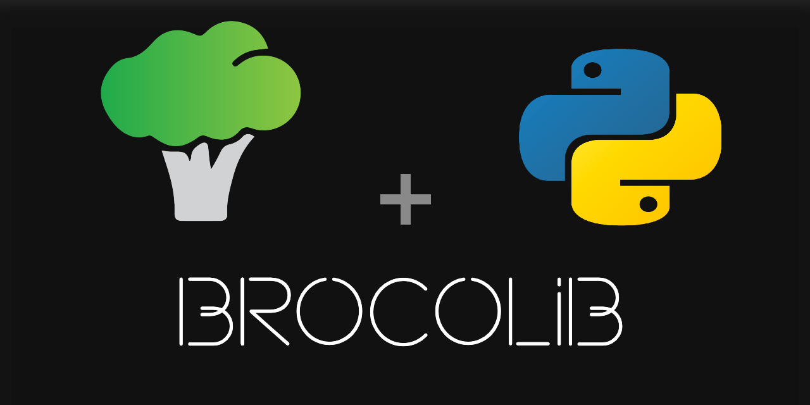

[](https://github.com/brocolidata/brocolib/actions/workflows/pytest_CI.yml)
[](https://github.com/brocolidata/brocolib/actions/workflows/brocolib_CD.yml)
# **brocolib**

Brocoli Library for Data Processing

# Installation
1. Create a GitHub [token](https://docs.github.com/en/authentication/keeping-your-account-and-data-secure/creating-a-personal-access-token)
2. Create an environment variable (for example *GIT_TOKEN*)  and fill its value with the token you just created
3. Then you can use
```
pip install git+https://${GIT_TOKEN}@github.com/brocolidata/brocolib/#subdirectory=src/factory_utils
```

# Development
## Prerequisites
- **Docker** (started) and docker-compose (just install Docker for Desktop if you are on laptop) 
- **VS Code** + VS Code extension [Remote - Containers](https://marketplace.visualstudio.com/items?itemName=ms-vscode-remote.remote-containers) 


## Development start
The first time you clone the project and each time you make changes to the Dockerfile, rerun
```
docker compose -f docker_build/docker-compose.yml build
```


## Quickstart
1. Rename **.env.example** to **.env** and replace dummy values with yours
2. Run the **Development start** process to create the image
3. Either **Build Source without running the dev container** (below) or **Open a Remote Window**  *(click on blue button left-down corner and click "Reopen in Container)*


## CI/CD

### CI
Creating a PR will trigger a CI pipeline.When changes located in `/src` are detected by the CI pipeline, it will run PyTests.


### CD
When you merge your PR, a CD pipeline will be triggered to create a PR to push the bdist_wheel for your new version to the `main` branch. 
*(You don't have to run and push the results of [Build Source without running the dev container](#build-source-without-running-the-dev-container-warning-below))*

***WARNING**: when we start to have risks of breaking changes in production, remove `rm -rf` in the code above in order to keep old versions when creating new ones if version numbers are fixed in [brocolidata/dataplatform_functions](https://github.com/brocolidata/dataplatform_functions)*


## Build Source without running the dev container (Test purposes)
**You don't have to run this command since the CD pipeline will create a PR to push the new sources to the `main` branch**.
Run the following command *(replace `DIRECTORY` by either `extract_load`, `transform` or `utils`)*
```
docker compose run --rm  brocolib bash build.sh DIRECTORY
```


## Brocolib Development
See [Brocolib Development](/src/README.md)
